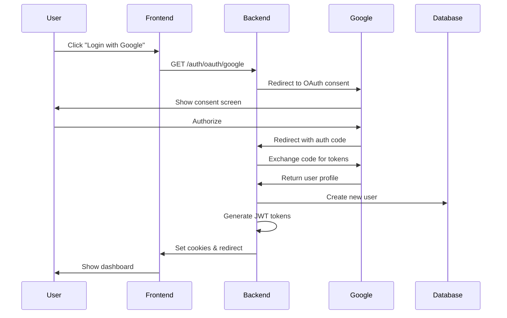
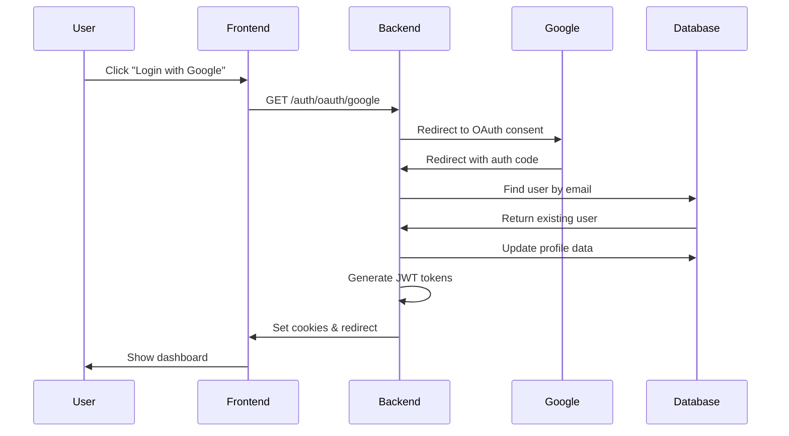

# Google OAuth 2.0 Implementation Guide

## 🎯 Overview

Enterprise-grade Google OAuth 2.0 implementation for the Sellr platform. This implementation follows industry best practices, clean architecture principles, and SOLID design patterns.

## 🏗️ Architecture

### **Design Patterns Used**

1. **Strategy Pattern** - OAuth authentication strategies
2. **Service Layer Pattern** - Business logic separation
3. **Guard Pattern** - Route protection and authorization
4. **Factory Pattern** - User creation logic
5. **Repository Pattern** - Data access abstraction (via Prisma)

### **Key Components**

```
src/auth/
├── strategies/
│   └── google.strategy.ts       # Passport Google OAuth strategy
├── services/
│   ├── oauth.service.ts         # OAuth business logic
│   ├── token.service.ts         # JWT token management (existing)
│   └── cookie.service.ts        # Cookie handling (existing)
├── guards/
│   └── google-oauth.guard.ts    # Google OAuth route guard
├── controllers/
│   └── oauth.controller.ts      # OAuth HTTP endpoints
└── dto/
    └── oauth-user.dto.ts        # OAuth data validation
```

## 📋 Prerequisites

- Node.js 18+ installed
- PostgreSQL database running
- Google Cloud Platform account
- Existing authentication system (email/password)

## 🚀 Setup Instructions

### Step 1: Configure Google Cloud Console

1. **Go to Google Cloud Console**

   - Navigate to: https://console.cloud.google.com/

2. **Create a New Project** (or select existing)

   - Click "Select a project" → "New Project"
   - Name: `Sellr-Production` or similar
   - Click "Create"

3. **Enable Google+ API**

   - Go to "APIs & Services" → "Library"
   - Search for "Google+ API"
   - Click "Enable"

4. **Configure OAuth Consent Screen**

   - Go to "APIs & Services" → "OAuth consent screen"
   - Select "External" (or Internal if G Workspace)
   - Fill in required fields:
     - App name: `Sellr`
     - User support email: Your email
     - Developer contact: Your email
   - Add scopes:
     - `.../auth/userinfo.email`
     - `.../auth/userinfo.profile`
   - Click "Save and Continue"

5. **Create OAuth 2.0 Credentials**
   - Go to "APIs & Services" → "Credentials"
   - Click "Create Credentials" → "OAuth 2.0 Client ID"
   - Application type: "Web application"
   - Name: `Sellr Backend`
   - Authorized JavaScript origins:
     ```
     http://localhost:3000
     http://localhost:3001
     https://your-production-domain.com
     ```
   - Authorized redirect URIs:
     ```
     http://localhost:3001/auth/oauth/google/callback
     https://your-api-domain.com/auth/oauth/google/callback
     ```
   - Click "Create"
   - **Copy** Client ID and Client Secret

### Step 2: Configure Environment Variables

1. **Open your `.env` file** in Backend folder

2. **Add Google OAuth credentials**:

```bash
# Google OAuth 2.0
GOOGLE_CLIENT_ID="YOUR_CLIENT_ID_HERE.apps.googleusercontent.com"
GOOGLE_CLIENT_SECRET="YOUR_CLIENT_SECRET_HERE"
GOOGLE_CALLBACK_URL="http://localhost:3001/auth/oauth/google/callback"

# JWT Token Expiration (if not already set)
JWT_EXPIRES_IN="45m"
JWT_REFRESH_EXPIRES_IN="7d"
JWT_EXPIRES_IN_MS="2700000"
JWT_REFRESH_EXPIRES_IN_MS="604800000"
```

3. **Verify other required variables**:

```bash
DATABASE_URL="postgresql://..."
FRONTEND_URL="http://localhost:3000"
JWT_SECRET="your-secret"
JWT_REFRESH_SECRET="your-refresh-secret"
```

### Step 3: Install Dependencies

Dependencies are already installed! If you need to reinstall:

```bash
cd Backend
npm install
```

### Step 4: Start the Server

```bash
npm run start:dev
```

You should see:

```
🚀 Application is running on port 3001
✅ Google OAuth Strategy initialized
```

## 🔌 API Endpoints

### 1. **Initiate Google Login**

```http
GET /auth/oauth/google
```

**Description**: Redirects user to Google OAuth consent screen

**Flow**:

1. User clicks "Login with Google" button
2. Frontend redirects to this endpoint
3. Backend redirects to Google OAuth
4. User authorizes on Google
5. Google redirects back to callback URL

**Frontend Implementation**:

```typescript
// React/Next.js
<a href="http://localhost:3001/auth/oauth/google">
  <button>Login with Google</button>
</a>

// Or with window.location
const handleGoogleLogin = () => {
  window.location.href = 'http://localhost:3001/auth/oauth/google';
};
```

### 2. **OAuth Callback** (Handled automatically)

```http
GET /auth/oauth/google/callback
```

**Description**: Processes Google OAuth callback

**Success Response**:

- Sets HTTP-only cookies: `access_token`, `refresh_token`
- Redirects to: `http://localhost:3000/dashboard?oauth=success`

**Error Response**:

- Redirects to: `http://localhost:3000/auth/error?message=...`

## 🔒 Security Features

### 1. **CSRF Protection**

- State parameter validation
- SameSite cookie attribute
- Origin validation

### 2. **Secure Token Storage**

- HTTP-only cookies (not accessible via JavaScript)
- Secure flag in production
- Token rotation on refresh

### 3. **Data Privacy**

- Minimal scope request (email + profile only)
- Secure password generation for OAuth accounts
- Profile data synchronization

### 4. **Account Security**

- Existing account linking (same email)
- Soft-delete validation
- Unique username generation
- Secure random password for hybrid auth

## 🔄 Authentication Flow

### New User Flow



### Existing User Flow



## 🧪 Testing

### Manual Testing

1. **Test OAuth Initiation**

```bash
# In browser, navigate to:
http://localhost:3001/auth/oauth/google
```

Expected: Redirects to Google OAuth consent screen

2. **Test Complete Flow**

- Click "Login with Google"
- Select Google account
- Authorize the app
- Should redirect to dashboard

3. **Verify Cookies Set**

- Open browser DevTools → Application → Cookies
- Should see: `access_token` and `refresh_token`

4. **Test Protected Endpoints**

```bash
# Get current user (should work with cookies)
curl -X GET http://localhost:3001/auth/me \
  --cookie "access_token=YOUR_TOKEN"
```

### Test with Postman

1. **Import OAuth Flow**

   - Create new request
   - GET `http://localhost:3001/auth/oauth/google`
   - Follow redirects manually

2. **Test User Creation**

   - Use different Google accounts
   - Verify users created in database

3. **Test Account Linking**
   - Create user via signup with email
   - Login with Google using same email
   - Verify account is linked

## 🗄️ Database Schema

The implementation uses your existing `User` model. No migration needed!

**Fields used**:

```prisma
model User {
  id            Int       @id @default(autoincrement())
  email         String    @unique
  username      String    @unique
  passwordHash  String    // Generated securely for OAuth users
  firstName     String?
  lastName      String?
  profilePic    String?   // Synced from Google
  role          Role      @default(USER)
  premiumTier   PremiumTier @default(FREE)
  availableSlots Int      @default(5)
  usedSlots     Int       @default(0)
  refreshToken  String?
  refreshTokenExp DateTime?
  // ... other fields
}
```

## 🎨 Frontend Integration

### Next.js Example

```typescript
// app/login/page.tsx
export default function LoginPage() {
  const handleGoogleLogin = () => {
    window.location.href = 'http://localhost:3001/auth/oauth/google';
  };

  return (
    <div>
      <button onClick={handleGoogleLogin}>
        Login with Google
      </button>
    </div>
  );
}
```

### React Example

```typescript
// components/GoogleLoginButton.tsx
import { FcGoogle } from 'react-icons/fc';

export const GoogleLoginButton = () => {
  const apiUrl = process.env.NEXT_PUBLIC_API_URL || 'http://localhost:3001';

  return (
    <a
      href={`${apiUrl}/auth/oauth/google`}
      className="flex items-center gap-2 px-4 py-2 border rounded-lg"
    >
      <FcGoogle size={20} />
      <span>Continue with Google</span>
    </a>
  );
};
```

### Handle OAuth Callback

```typescript
// app/dashboard/page.tsx
'use client';
import { useEffect } from 'react';
import { useSearchParams } from 'next/navigation';

export default function DashboardPage() {
  const searchParams = useSearchParams();
  const oauthSuccess = searchParams.get('oauth');

  useEffect(() => {
    if (oauthSuccess === 'success') {
      // Show success message
      console.log('OAuth login successful!');
      // Remove query param
      window.history.replaceState({}, '', '/dashboard');
    }
  }, [oauthSuccess]);

  return <div>Dashboard</div>;
}
```

### Error Handling

```typescript
// app/auth/error/page.tsx
'use client';
import { useSearchParams } from 'next/navigation';

export default function AuthErrorPage() {
  const searchParams = useSearchParams();
  const message = searchParams.get('message');

  return (
    <div>
      <h1>Authentication Error</h1>
      <p>{message || 'An error occurred during authentication'}</p>
      <a href="/login">Try Again</a>
    </div>
  );
}
```

## 🔧 Troubleshooting

### Issue: "Redirect URI Mismatch"

**Solution**:

- Verify callback URL in Google Cloud Console matches exactly
- Check for trailing slashes
- Ensure protocol (http/https) matches

### Issue: "Google Strategy not found"

**Solution**:

```bash
# Reinstall dependencies
npm install passport-google-oauth20 @types/passport-google-oauth20
```

### Issue: "User email not provided"

**Solution**:

- Verify scopes include `email`
- Check Google account has verified email
- Ensure OAuth consent screen is configured

### Issue: "CORS Error"

**Solution**:

```typescript
// main.ts - Verify CORS configuration
app.enableCors({
  origin: 'http://localhost:3000',
  credentials: true,
});
```

## 📊 Monitoring & Logging

The implementation includes comprehensive logging:

```typescript
✅ Google OAuth Strategy initialized
🚀 Initiating Google OAuth flow
🔍 Validating Google profile for: user@example.com
✅ Google profile validated: user@example.com
🆕 Creating new user from OAuth: user@example.com
✅ New OAuth user created: user@example.com
✅ OAuth authentication successful: user@example.com
```

Monitor these logs for:

- Authentication success/failure rates
- User creation vs. login rates
- Error patterns

## 🚀 Production Deployment

### 1. Update Environment Variables

```bash
GOOGLE_CLIENT_ID="your-production-client-id"
GOOGLE_CLIENT_SECRET="your-production-secret"
GOOGLE_CALLBACK_URL="https://api.yourdomain.com/auth/oauth/google/callback"
FRONTEND_URL="https://yourdomain.com"
NODE_ENV="production"
```

### 2. Update Google Cloud Console

- Add production URLs to authorized origins
- Add production callback URL to redirect URIs
- Switch OAuth consent screen to "Production"

### 3. Enable Security Features

All security features are already implemented:

- ✅ HTTP-only cookies
- ✅ Secure flag in production
- ✅ SameSite=Strict
- ✅ Token rotation
- ✅ CSRF protection

### 4. Performance Optimization

Consider adding:

- Rate limiting (e.g., express-rate-limit)
- Redis for session storage
- CDN for static assets
- Database connection pooling

## 📚 Additional Resources

- [Google OAuth 2.0 Documentation](https://developers.google.com/identity/protocols/oauth2)
- [Passport.js Documentation](http://www.passportjs.org/)
- [NestJS Authentication](https://docs.nestjs.com/security/authentication)

## ✅ Implementation Checklist

- [x] Google OAuth strategy implementation
- [x] OAuth service for user management
- [x] OAuth controller with endpoints
- [x] Guard for route protection
- [x] DTO for data validation
- [x] Integration with existing auth system
- [x] Cookie-based authentication
- [x] Token generation and refresh
- [x] Comprehensive error handling
- [x] Logging and monitoring
- [x] Security best practices
- [x] Documentation

## 🎓 Code Quality

This implementation follows:

- ✅ SOLID Principles
- ✅ Clean Architecture
- ✅ Enterprise Design Patterns
- ✅ TypeScript Best Practices
- ✅ NestJS Conventions
- ✅ Security Best Practices
- ✅ Comprehensive Documentation

---

**Need Help?** Check the troubleshooting section or review the inline code documentation.
